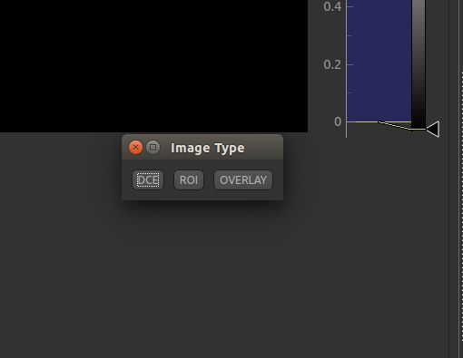
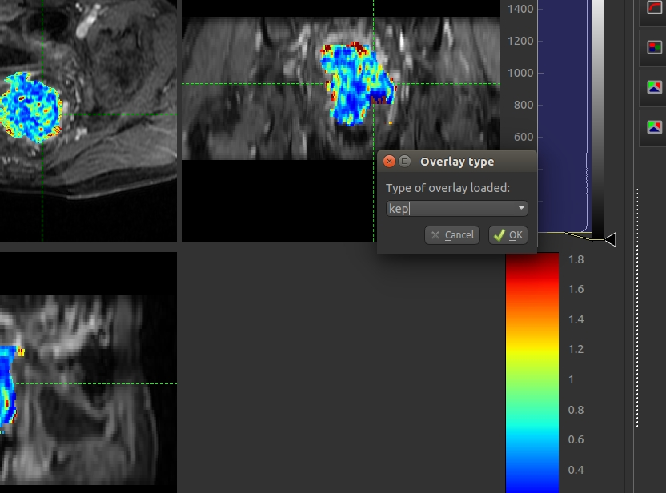
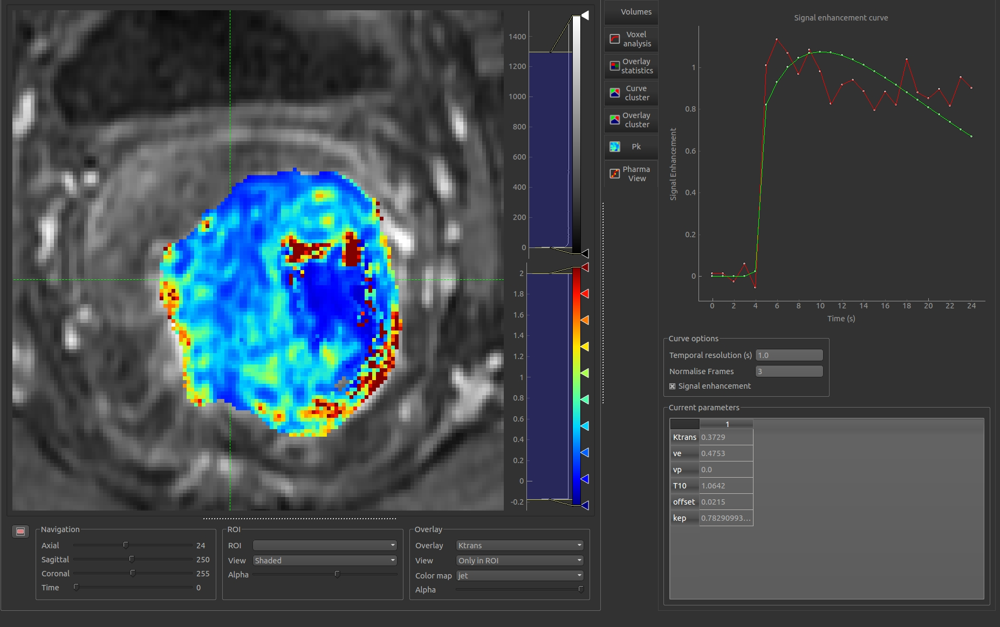
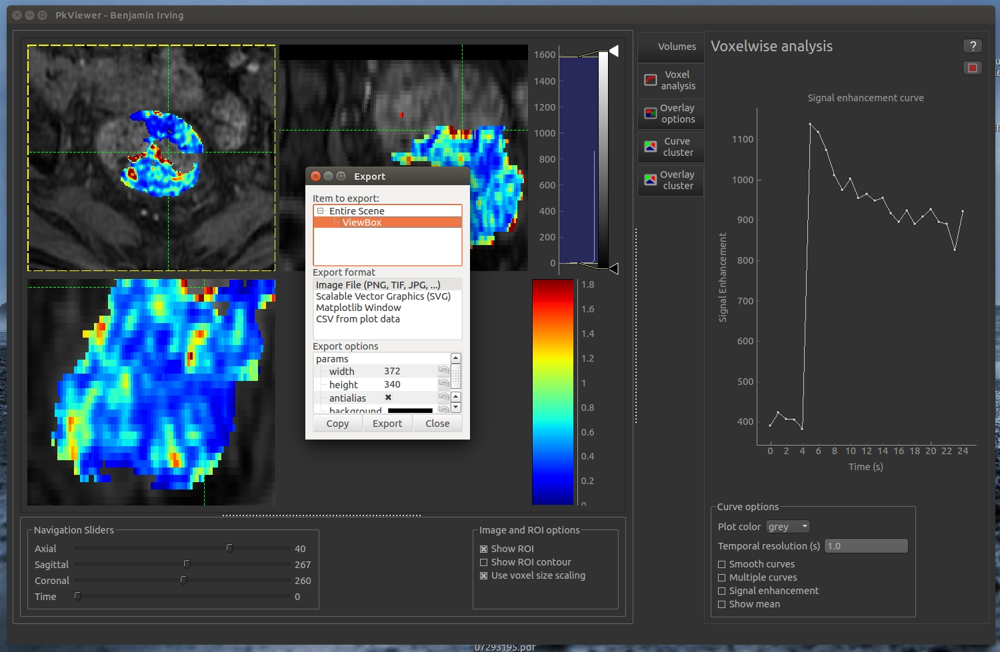
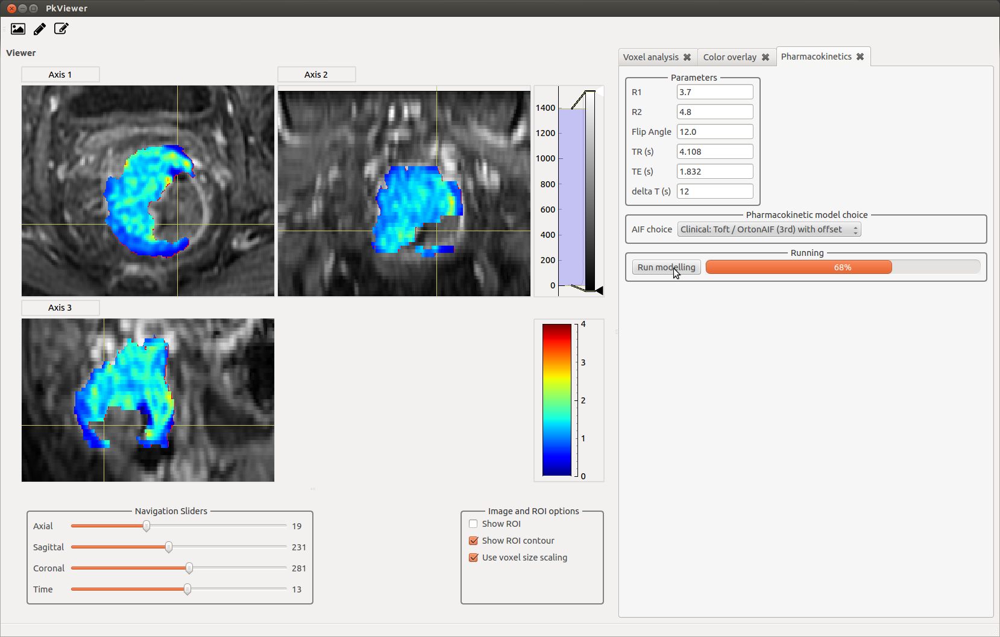
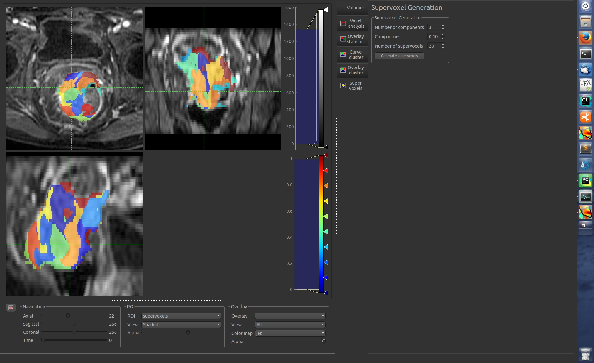
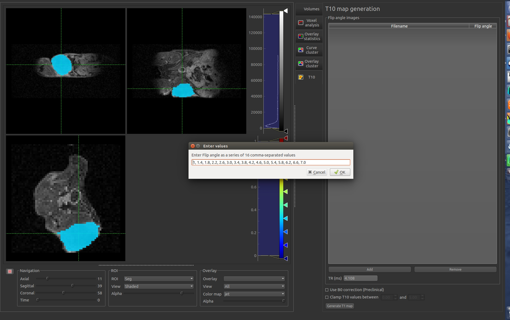
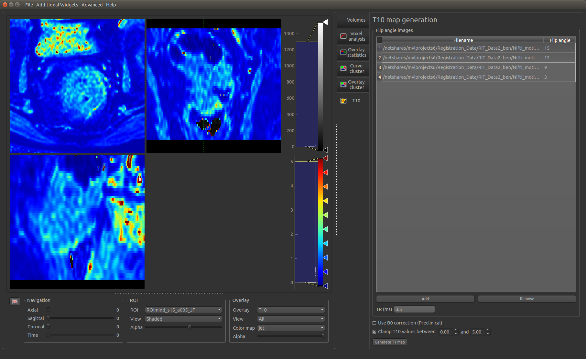

# Quantiphyse 

Created by [Ben Irving](mailto:mail@birving.com)

Quantiphyse is a viewer for 3D and 4D functional data and Pharmacokinetic modelling. It is not yet publicly available, please contact the current maintainer [martin.craig@eng.ox.ac.uk](mailto:martin.craig@eng.ox.ac.uk) if you wish to use the software

This documentation is based on release version 0.31

## License

Licensing details will be added on first public release

## Overview

Quantiphyse works with three types of image:

 - The main volume. This is typically a 4D data set and defines the dimensions of the data. All other images must have consistent
 dimensions. Only one main volume can be loaded, if a new main volume is loaded all other data will be cleared.
 
 - Overlays. These may be 3D or 4D, if they are 4D the fourth dimension must currently match the 4th dimension of the main volume. They are viewed as colour images on top of the main volume.
 
 - Regions of Interest (ROIs). These must be 3D and contain integer data only. Voxels with the value zero are taken to be outside the 
 region of interest, nonzero values are inside. ROIs with more than one nonzero value describe multi-level regions of interest which
 are handled by some of the tools in PkView.

#### Nifti 

This software package works with NIFTI volumes. DICOM files will need to be converted to NIFTI first using one of a number of tools including: 

 - [itk-snap](http://www.itksnap.org/pmwiki/pmwiki.php), 
 - [dcm2nii](https://www.nitrc.org/plugins/mwiki/index.php/dcm2nii:MainPage) 
 - Or the batch version which allows a number of volumes to be converted [dcm2niibatch](https://github.com/rordenlab/dcm2niix)

#### Loading the main volume

Either: 

 - Drag and drop a NIFTI file onto the viewer

or

 - File -> Load Image Volume
 

When dragging and dropping, a window will pop up to specify whether the image is the 4D main volume, and ROI or an overlay. 

The image will appear in the 3 orthographic views. 

#### Load ROI and overlays

Drag-and-drop or use the `File` menu to load overlays and ROIs in a similar way.

For overlays a type must be given - a list of standard types is provided or you can specify your own.

You can switch between loaded or generated overlays using the list box below the main viewing windows, or from the *current overlays* section of the **Volumes** widget. 

## General interaction

- Scroll mouse button to navigate through the volume
- Left click on a point to navigate through the volume
- Hold right button and move mouse to zoom
- Use the sliders at the bottom to navigate through the volume
- Double click on a window to expand (see below)

*Hold right button and move mouse to zoom*

*Double click to expand one window*

## Volume, ROI and overlay interaction

## Voxel analysis widget

- The voxel analysis widget gives the enhancement curve of the currently selected location. 

- Multiple points can be selected with multiple colors
- Mean curves for each color can be calculated
- Points can be cleared with X

## Saving images

#### Save a screen shot or plot

- Right click on an image or plot
- Click *Export*
- A view box will appear with the various format options. 
- *svg* format will allow editing of the layers and nodes in inkscape or another vector graphics viewer. 

#### Save an overlay to NIFTI file

File -> Save Current overlay

## Overlay statistics widget

- Statistics for each defined ROI
- Mean, Median, Variance, Min and Max

## Curve clustering widget

- PCA based curve clustering allows clustering of tumour subregions based on contrast enhancement characteristics. 
- Number of clusters
- PCA modes used for clustering
- Advanced options: Merge clusters, auto merge clusters, get cluster sizes

## Overlay clustering widget

- Cluster based on a particular ROI map
- Step 1: Select the overlay of interest

- Step 2: Cluster based on the selected ROI. 
- Get slice and volume statistics

## Supervoxel widget
Create supervoxel regions within an ROI (see https://arxiv.org/abs/1606.09518v2)

## Mean value widget
Generate mean values from the current overlays for each ROI. 

*Example showing mean Ktrans value of each supervoxel*

## T1 mapping widget
Generate T1 maps from variable flip angle images (used as a preprocessing step for PK modelling)

*Using a single 4D volume with multiple flip angles*

*Loading muliple flip angle volumes*

## Visualisation of model fit widget
- *Additional Widgets -> PharmCurveView*
- If Pk modelling has been run or *model curves* are loaded from a nifti file then visualise the difference in parameters between the model fit and the true data. 

[PK modelling widget](pk.md)

Images copyright 2016, 2017 Benjamin Irving

