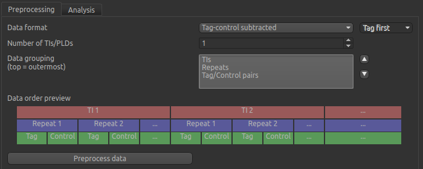

ASL Analysis
============

- *Widgets -> Fabber -> ASL*

This widget provides Arterial Spin Labelling MRI analysis using the Fabber Bayesian model fitting framework.

To do ASL analysis you will need to know the following:

 - Whether your data is tag-control pairs, already subtracted or multi-phase
 - The ordering of the volume sequence in your data (e.g. whether tag-control pairs occur together, or whether all the tags come first)
 - Details of the aquisition sequence (e.g. number of TIs/PLDs used and their values, bolus durations, number of repeats etc)

Preprocessing
-------------

Preprocessing consists of manipulating the data so that is in the form of subtracted Tag-Control difference volumes ordered initially by varying TIs/PLDs, and secondarily by repeats

First choose the data format - Tag-control pairs, tag-control subtracted or multiphase. If your data is tag-control pairs, you must
specify which comes first - Tag or Control. You should also indicate the number of TIs/PLDs used although the values will only be needed later.

The data grouping is critical. For example the sequence of volumes in your data might be as follows:

 - Tag for first TI
 - Control for first TI
 - Tag for second TI
 - Control for second TI
 - ... as above for remaining TIs
 - Repeat of Tag for first TI
 - Repeat of Control for first TI
 - ... etc
 
The data grouping box enables you to choose how the Tag-Control pairs, the repeats and the TIs are ordered in your data. You can drag the items in the list to reorder them, or use the Up/Down buttons. To make this easier, a visualisation is shown below. For example the  ordering described above would be described as Repeats (outermost), TIs, TC pairs (innermost), and would be shown as follows:

.. image:: screenshots/asl_grouping_rtp.png

Alternatively the same data might be in a different order:

 - Control for first TI
 - Control for second TI
 - ... as above for remaining TIs
 - Tag for first TI
 - Tag for second TI
 - ... as above for remaining TIs
 - Repeat of Control for first TI
 - Repeat of Control for second TI
 - ... etc

This would be described as Repeats (outermost), CT pairs, TIs (innermost), and would be shown as follows:

.. image:: screenshots/asl_grouping_rpt.png

When the grouping is set up correctly, click ``Preprocess`` to perform the tag-control subtraction. The code will check that the number of TIs and pairs is consistent with the number of data volumes, for example if you have two TIs and tag-control pairs the number of volumes must be a multiple of 4.

The subtracted data will be named ``asldata`` and becomes the main data in the interface. Here's an example:

.. image:: screenshots/asl_diffdata.png

ASL data can be very noisy!

Analysis
--------
