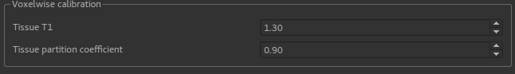
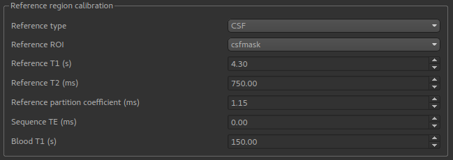

ASL Calibration
===============

- *Widgets -> ASL Calibration*

The ASL Calibration widget is required to turn the perfusion images from ASL model fitting into physical units.

Basic data specification
------------------------

.. image:: screenshots/asl_calib_data.png

To do calibration you specify a data set containing a perfusion image. If you want to calibrate an image containing perfusion
variance, the ``Data type`` selection must be changed (because the scaling factors must be squared in this case).

Calibration methods
-------------------

Two calibration methods are provided:

- ``Voxelwise`` calibration, in which an M0 correction factor is determined for each voxel from the calibration image.
- ``Reference region`` calibration, in which a single M0 correction factor is determined for the whole image, by analysing a 
  region of the data containing a single tissue type (typically CSF).
  
Calibration data
----------------

Certain parameters are required regardless of which calibration method you use:

.. image:: screenshots/asl_calib_calibdata.png

Voxelwise calibration
---------------------

Voxelwise calibration requires a generic estimate of the T1 and the partition coefficient which will be applied to
all voxels.

Reference region calibration
---------------------

The reference region method requires a ``Reference ROI`` which identifies a particular tissue type. This would normally be 
created by a segmentation tool such as FAST, however you could also use the ``ROI Builder`` to identify a region of the
calibration image of a known tissue type. CSF is the most common.

The T1, T2 and partition coefficient for this tissue type must be specified. Default values are provided for CSF, WM and GM.
In addition the sequence TE and blood T1 estimates are required.

Output
------

Calibration returns a new data set with the suffix ``_calib``, for example ``perfusion_calib``.

