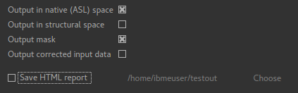

ASL Output Tab
==============

This tab controls the output that will be produced.

Standard data item outputs
--------------------------

The following data items are output:

  - ``perfusion`` Tissue perfusion
  - ``arrival`` Inferred arterial transit time
  - ``modelfit`` Model prediction for comparison with the tag-control differenced data

If ``Fix label duration`` is *not* specified:

  - ``duration`` Inferred Label duration

If ``Fix arterial transit time`` is *not* specified:

  - ``arrival`` Inferred arterial transit time

If ``Include macro vascular component`` *is* specified:

  - ``aCBV`` Macrovascular component
  
If ``Allow uncertainty in T1 values`` *is* specified:

  - ``mean_T_1`` Tissue T1 value
  - ``mean_T_1b`` Blood T1 value

If calibration is included, additional calibrated outputs ``perfusion_calib`` and ``aCBV_calib``
are also generated.

Output data spaces
^^^^^^^^^^^^^^^^^^

By default the output is produced in `native` ASL space (i.e. the same space as the input
ASL data). These outputs have the suffix ``_native``. In addition (or instead of) output
can be produced in structural space, in which case the outputs will have a suffix of ``_struc``.

Output mask
-----------

If selected the mask used to perform the analysis will be output under the name ``mask_native``.

Save HTML report
----------------

A summary report in HTML format can be generated - if required you need to select this option
and choose an output directory:

.. image:: screenshots/asl_output_report.png
