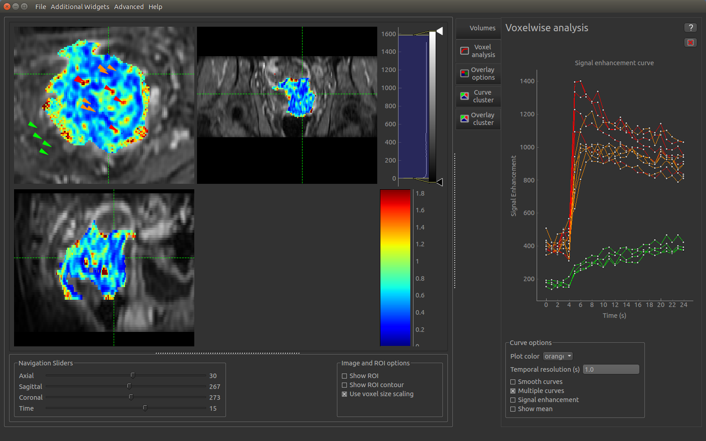

Multi-voxel analysis
====================

- This widget shows the signal-time curve at multiple locations.

.. image:: screenshots/curve_compare_single.png

- Each click on the image adds a new curve to the plot. By changing
  the colour, a series of curves can be plotted enabling different parts of the image to be compared

- The mean curve for each color can also be displayed. This is shown with large circular markers and 
  a dotted line.

- If 'smooth curves' is selected, the line will not pass through each point but instead follow a smoother
  curve that approximates the points.

- The plot can be cleared by clicking on the red X at the top right of the window

