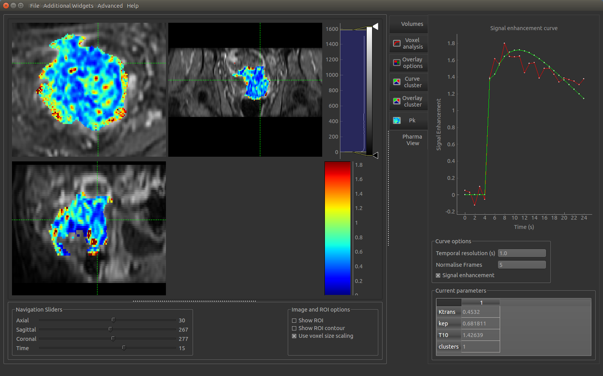

Visualisation of model fit widget
=================================

- *Widgets -> Model Curve*

This widget shows the original data curves at the focus point alongside any additional 4D curves from overlays.
Typically these are generated by modelling processes, for example the PK modelling widget, and enable the
model prediction to be compared to the original data.

Below the plot a table shows all the 4D data sets loaded. The checkboxes control whether a given data
set is included in the plot or not. In addition, the RMS difference between each data set and the main
data at the selected position is also calculated so the degree of similarity can be assessed.

A second table shows the value of each 3D data set at the focus point. This is useful after running
modelling as the model parameters can be viewed at the same time as comparing the overall quality of the
model fit.

The comparison can be made either on the raw data or by transforming the curves to signal enhancement. 
The selected number of volumes are treated as 'baseline' and the remainder of the data is scaled such
that the mean value of the baseline volumes is 1.

