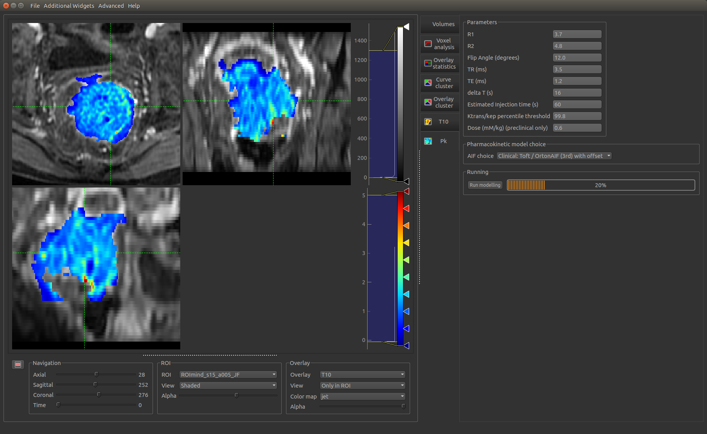
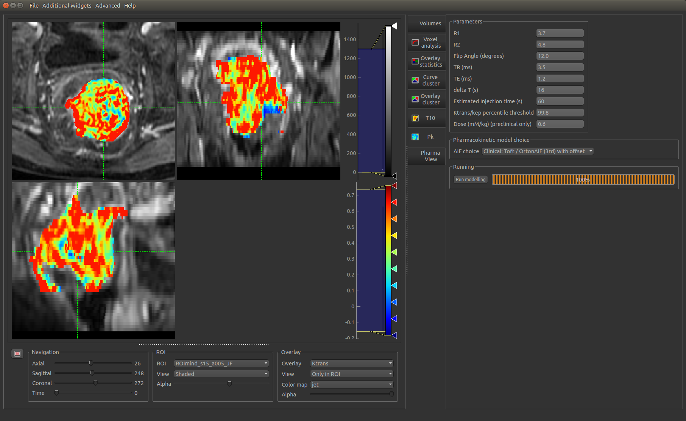

PK modelling widget
===================

- Load DCE-MRI, ROI and T10 map
- Select pharamacokinetic model
- Input image parameters
- Run modelling inside the ROI

*Start of modelling*

*Modelling complete with newly generated Ktrans map*

*Still required:*

- Inclusion of Contrast-to-noise ratio restriction
