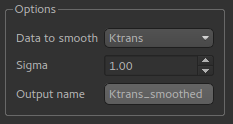

Smoothing
=========

*Widgets -> Processing -> Smoothing*

This widget provides simple Gaussian smoothing.

Sample input
------------

.. image:: screenshots/smoothing_in.png

Sample output
------------

.. image:: screenshots/smoothing_out.png

Options
-------

``Sigma`` is the standard deviation of the Gaussian used in the convolution.
